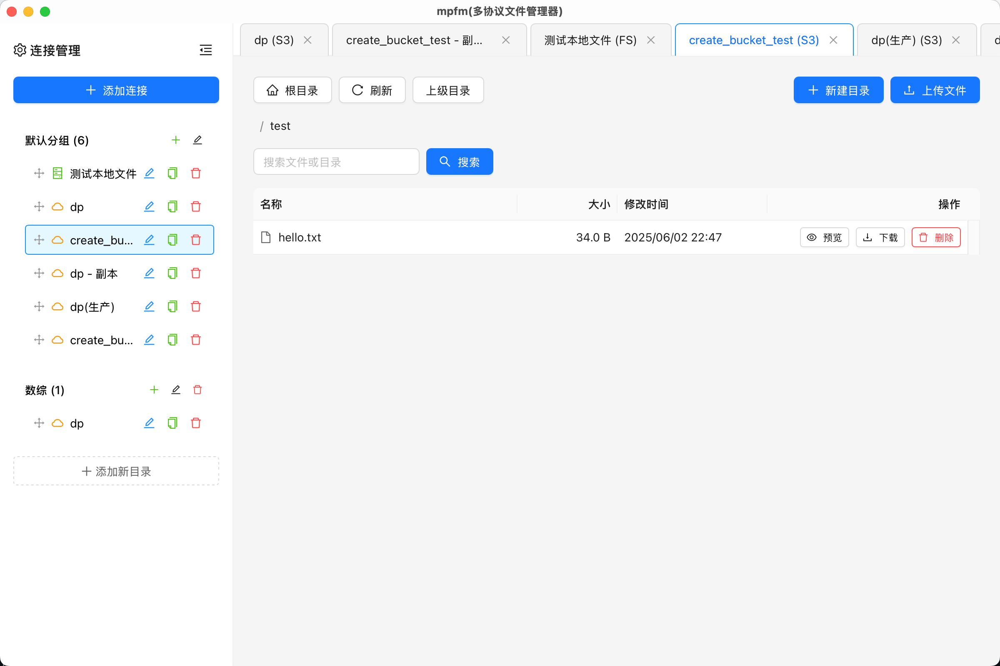

# Multi-Protocol File Manager (MPFM)

[🇨🇳 中文](README_zh.md) | **🇺🇸 English**

A cross-platform multi-protocol file manager based on [Apache OpenDAL™](https://opendal.apache.org/), providing both command-line interface and graphical interface.

## 📋 Features

- 🌐 **Multi-Protocol Support**: Support for local filesystem, S3-compatible storage, and other protocols
- 🖥️ **Dual Interface**: Provides both command-line tools and modern graphical interface
- 🔧 **Connection Management**: Save and manage multiple storage connection configurations
- 📁 **Complete File Operations**: Support for file/directory listing, upload, download, delete, create, and more
- 🚀 **Cross-Platform**: Support for Windows, Linux, and macOS
- ⚡ **High Performance**: Built with Rust, featuring async I/O operations

## 📸 Demo

### Main Interface Preview



*Multi-Protocol File Manager Main Interface - Unified file management experience supporting multiple storage protocols*

## 🏗️ Project Architecture

### Overall Structure

```
mpfm/
├── 📁 src/                     # Rust backend source code
│   ├── main.rs                 # Tauri GUI entry point
│   ├── main_cli.rs             # Command-line interface entry point
│   ├── tauri_commands.rs       # Tauri command handlers
│   ├── 📁 cli/                 # Command-line interface module
│   │   ├── app.rs              # CLI application main logic
│   │   ├── commands.rs         # CLI command implementations
│   │   └── mod.rs
│   ├── 📁 core/                # Core functionality modules
│   │   ├── config.rs           # Configuration management
│   │   ├── error.rs            # Error handling
│   │   ├── file.rs             # File operations
│   │   └── mod.rs
│   ├── 📁 protocols/           # Protocol adapters
│   │   ├── fs.rs               # Local filesystem
│   │   ├── s3.rs               # S3 protocol
│   │   ├── traits.rs           # Protocol interface definitions
│   │   └── mod.rs
│   └── 📁 utils/               # Utility functions
│       ├── logger.rs           # Logging utilities
│       └── mod.rs
├── 📁 ui/                      # React frontend source code
│   ├── src/
│   │   ├── App.tsx             # Main application component
│   │   ├── main.tsx            # Application entry point
│   │   ├── types.ts            # TypeScript type definitions
│   │   ├── 📁 components/      # React components
│   │   └── 📁 services/        # API service layer
│   ├── package.json            # Frontend dependencies configuration
│   └── vite.config.ts          # Vite build configuration
├── Cargo.toml                  # Rust project configuration
├── tauri.conf.json             # Tauri application configuration
└── package.json                # Tauri CLI configuration
```

### Tech Stack

**Backend (Rust)**
- [OpenDAL](https://opendal.apache.org/) - Unified storage access layer
- [Tauri](https://tauri.app/) - Cross-platform desktop application framework
- [Tokio](https://tokio.rs/) - Async runtime
- [Clap](https://clap.rs/) - Command-line argument parser

**Frontend (TypeScript + React)**
- [React 18](https://react.dev/) - UI framework
- [Ant Design](https://ant.design/) - UI component library
- [Vite](https://vitejs.dev/) - Build tool
- [TypeScript](https://www.typescriptlang.org/) - Type safety

## 🚀 Quick Start

### Prerequisites

- Rust 1.87.0+
- Node.js 18+
- pnpm or npm

### Install Dependencies

```bash
# Clone the project
git clone <repository-url>
cd mpfm

# Install Rust dependencies (automatic)
cargo check

# Install frontend dependencies
cd ui && pnpm install && cd ..

# Install Tauri CLI
pnpm install
```

### Launch Application

#### Method 1: GUI Mode (Recommended)

Launch Tauri desktop application with complete graphical interface:

```bash
pnpm run tauri:dev
```

This will:
1. Automatically start the frontend development server (React + Vite)
2. Compile and run the Rust backend
3. Open the desktop application window

#### Method 2: CLI Mode

Use command-line tool only:

```bash
# View help
cargo run --bin main_cli -- --help

# View available commands
cargo run --bin main_cli
```

#### Method 3: Frontend Demo Mode

Launch frontend interface only (demo mode with mock data):

```bash
cd ui
pnpm dev
```

Then visit `http://localhost:1420` in your browser

## 💻 Usage Guide

### GUI Operations

1. **Launch Application**: Run `npm run tauri:dev`
2. **Add Connection**: Click "Add Connection" in the left panel
3. **Select Connection**: Choose the storage you want to use from the connection list
4. **File Operations**: Perform file operations in the right file manager

### Command Line Operations

#### Connection Management

```bash
# Add local filesystem connection
cargo run --bin main_cli -- connection add

# Add S3 connection
cargo run --bin main_cli -- connection add

# List all connections
cargo run --bin main_cli -- connection list

# Remove connection
cargo run --bin main_cli -- connection remove <connection-id>
```

#### File Operations

```bash
# List files and directories
cargo run --bin main_cli -- ls --connection <connection-id> [path]

# Upload file
cargo run --bin main_cli -- upload --connection <connection-id> <local-path> <remote-path>

# Download file
cargo run --bin main_cli -- download --connection <connection-id> <remote-path> <local-path>

# Delete file or directory
cargo run --bin main_cli -- rm --connection <connection-id> <path>

# Create directory
cargo run --bin main_cli -- mkdir --connection <connection-id> <path>

# View file information
cargo run --bin main_cli -- stat --connection <connection-id> <path>
```

## 🔧 Supported Protocols

### Currently Supported

- ✅ **Local Filesystem (fs)**: Local disk file operations
- ✅ **S3 Protocol**: AWS S3, MinIO, Ceph, and other S3-compatible storage

### Planned Support

- 🔄 SFTP
- 🔄 FTP
- 🔄 WebDAV
- 🔄 Azure Blob Storage
- 🔄 Google Cloud Storage
- 🔄 Alibaba Cloud OSS
- 🔄 Tencent Cloud COS

## 🔨 Build Release

```bash
# Build Tauri application
pnpm run tauri:build

# Build CLI tool
cargo build --release --bin main_cli
```

Build artifacts location:
- Tauri application: `target/release/bundle/`
- CLI tool: `target/release/main_cli`

## 🐛 Troubleshooting

### Common Issues

1. **Port Conflict**: If you encounter port conflicts, modify the port number in `ui/vite.config.ts`
2. **Permission Issues**: Ensure you have read/write permissions for target directories
3. **Connection Failure**: Check network connectivity and storage service configuration
4. **macOS Installation Failure**: If installation shows "mpfm is damaged and can't be opened", run `sudo xattr -r -d com.apple.quarantine /Applications/mpfm.app` to resolve

### Development Debugging

```bash
# Enable debug logging
RUST_LOG=debug cargo run --bin main_cli

# Check code issues
cargo clippy

# Run tests
cargo test
```

## 🤝 Contributing

Welcome to contribute code, report issues, or suggest improvements!

1. Fork the project
2. Create a feature branch: `git checkout -b feature/amazing-feature`
3. Commit your changes: `git commit -m 'Add some amazing feature'`
4. Push to the branch: `git push origin feature/amazing-feature`
5. Submit a Pull Request

## 📄 License

This project is licensed under the MIT License - see the [LICENSE](LICENSE) file for details.

## 🙏 Acknowledgments

- [Apache OpenDAL™](https://opendal.apache.org/) - Providing unified storage access interface
- [Tauri](https://tauri.app/) - Modern desktop application development framework
- [Rust Community](https://www.rust-lang.org/) - Excellent systems programming language ecosystem