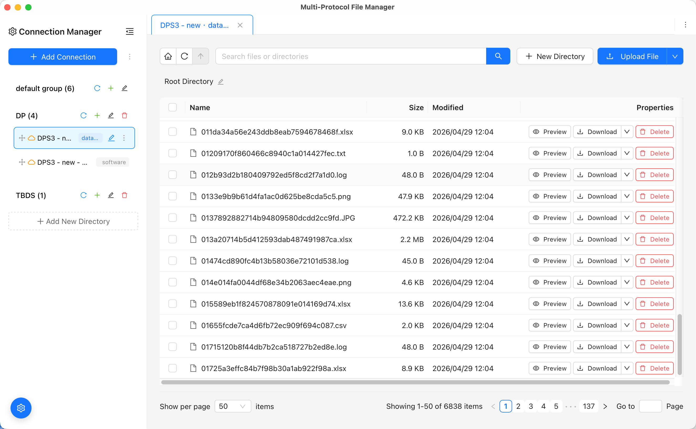

# 多协议文件管理器 (MPFM)

**🇨🇳 中文** | [🇺🇸 English](README.md)

基于 [Apache OpenDAL™](https://opendal.apache.org/) 的跨平台多协议文件管理器，提供命令行界面和图形界面两种使用方式。

## 📋 功能特点

- 🌐 **多协议支持**：支持本地文件系统、S3 兼容存储等多种协议
- 🖥️ **双界面模式**：提供命令行工具和现代化图形界面
- 🔧 **连接管理**：可保存和管理多个存储连接配置
- 📁 **完整文件操作**：支持文件/目录的列表、上传、下载、删除、创建等操作
- 🚀 **跨平台**：支持 Windows、Linux 和 macOS
- ⚡ **高性能**：基于 Rust 构建，异步 I/O 操作

## 📸 演示效果

### 主界面预览



*多协议文件管理器主界面 - 支持多种存储协议的统一文件管理体验*

## 🏗️ 项目架构

### 整体结构

```
mpfm/
├── 📁 src/                     # Rust 后端源码
│   ├── main.rs                 # Tauri 图形界面入口
│   ├── main_cli.rs             # 命令行界面入口
│   ├── tauri_commands.rs       # Tauri 命令处理
│   ├── 📁 cli/                 # 命令行界面模块
│   │   ├── app.rs              # CLI 应用主逻辑
│   │   ├── commands.rs         # CLI 命令实现
│   │   └── mod.rs
│   ├── 📁 core/                # 核心功能模块
│   │   ├── config.rs           # 配置管理
│   │   ├── error.rs            # 错误处理
│   │   ├── file.rs             # 文件操作
│   │   └── mod.rs
│   ├── 📁 protocols/           # 协议适配器
│   │   ├── fs.rs               # 本地文件系统
│   │   ├── s3.rs               # S3 协议
│   │   ├── traits.rs           # 协议接口定义
│   │   └── mod.rs
│   └── 📁 utils/               # 工具函数
│       ├── logger.rs           # 日志工具
│       └── mod.rs
├── 📁 ui/                      # React 前端源码
│   ├── src/
│   │   ├── App.tsx             # 主应用组件
│   │   ├── main.tsx            # 应用入口
│   │   ├── types.ts            # TypeScript 类型定义
│   │   ├── 📁 components/      # React 组件
│   │   └── 📁 services/        # API 服务层
│   ├── package.json            # 前端依赖配置
│   └── vite.config.ts          # Vite 构建配置
├── Cargo.toml                  # Rust 项目配置
├── tauri.conf.json             # Tauri 应用配置
└── package.json                # Tauri CLI 配置
```

### 技术栈

**后端 (Rust)**
- [OpenDAL](https://opendal.apache.org/) - 统一存储访问层
- [Tauri](https://tauri.app/) - 跨平台桌面应用框架
- [Tokio](https://tokio.rs/) - 异步运行时
- [Clap](https://clap.rs/) - 命令行参数解析

**前端 (TypeScript + React)**
- [React 18](https://react.dev/) - UI 框架
- [Ant Design](https://ant.design/) - UI 组件库
- [Vite](https://vitejs.dev/) - 构建工具
- [TypeScript](https://www.typescriptlang.org/) - 类型安全

## 🚀 快速开始

### 环境要求

- Rust 1.87.0+
- Node.js 18+
- pnpm 或 npm

### 安装依赖

```bash
# 克隆项目
git clone <repository-url>
cd mpfm

# 安装 Rust 依赖（自动）
cargo check

# 安装前端依赖
cd ui && pnpm install && cd ..

# 安装 Tauri CLI
pnpm install
```

### 启动应用

#### 方法1：图形界面模式（推荐）

启动 Tauri 桌面应用，包含完整的图形界面：

```bash
pnpm run tauri:dev
```

这会：
1. 自动启动前端开发服务器（React + Vite）
2. 编译并运行 Rust 后端
3. 打开桌面应用窗口

#### 方法2：命令行模式

仅使用命令行工具：

```bash
# 查看帮助
cargo run --bin main_cli -- --help

# 查看可用命令
cargo run --bin main_cli
```

#### 方法3：前端演示模式

仅启动前端界面（演示模式，使用模拟数据）：

```bash
cd ui
pnpm dev
```

然后在浏览器中访问 `http://localhost:1420`

## 💻 使用指南

### 图形界面操作

1. **启动应用**：运行 `npm run tauri:dev`
2. **添加连接**：在左侧面板点击"添加连接"
3. **选择连接**：从连接列表中选择要使用的存储
4. **文件操作**：在右侧文件管理器中进行文件操作

### 命令行操作

#### 连接管理

```bash
# 添加本地文件系统连接
cargo run --bin main_cli -- connection add

# 添加 S3 连接
cargo run --bin main_cli -- connection add

# 列出所有连接
cargo run --bin main_cli -- connection list

# 删除连接
cargo run --bin main_cli -- connection remove <connection-id>
```

#### 文件操作

```bash
# 列出文件和目录
cargo run --bin main_cli -- ls --connection <connection-id> [path]

# 上传文件
cargo run --bin main_cli -- upload --connection <connection-id> <local-path> <remote-path>

# 下载文件
cargo run --bin main_cli -- download --connection <connection-id> <remote-path> <local-path>

# 删除文件或目录
cargo run --bin main_cli -- rm --connection <connection-id> <path>

# 创建目录
cargo run --bin main_cli -- mkdir --connection <connection-id> <path>

# 查看文件信息
cargo run --bin main_cli -- stat --connection <connection-id> <path>
```

## 🔧 支持的协议

### 当前支持

- ✅ **本地文件系统 (fs)**：本地磁盘文件操作
- ✅ **S3 协议**：AWS S3、MinIO、Ceph 等 S3 兼容存储

### 计划支持

- 🔄 SFTP
- 🔄 FTP
- 🔄 WebDAV
- 🔄 Azure Blob Storage
- 🔄 Google Cloud Storage
- 🔄 阿里云 OSS
- 🔄 腾讯云 COS

## 🔨 构建发布版本

```bash
# 安装 root/ui 依赖
pnpm run bootstrap

# 本地跑一遍发布前检查、测试和构建
pnpm run build:release

# 一键发版
pnpm run release -- 0.2.4

# 只构建桌面端
pnpm run build:desktop

# 只构建 CLI
pnpm run build:cli
```

构建产物位置：
- Tauri 应用：`target/release/bundle/`
- CLI 工具：`target/release/main_cli`

## 🚀 GitHub 发版

```bash
# 一键发版
pnpm run release -- 0.2.4
```

如果只想先演练但不真正 push / tag：

```bash
pnpm run release -- --dry-run 0.2.4
```

推送 `v*` tag 后会发生：
- `release.yml` 自动构建 macOS、Linux 和默认 Windows 桌面安装包
- `release.yml` 会把 `main_cli` 的压缩包附加到同一个 draft release
- `release.yml` 也会把 fixed WebView2 的 Windows 特别版一起发布到同一个 draft release

## 🐛 故障排除

### 常见问题

1. **端口冲突**：如果遇到端口占用，修改 `ui/vite.config.ts` 中的端口号
2. **权限问题**：确保对目标目录有读写权限
3. **连接失败**：检查网络连接和存储服务配置
4. **mac安装失败**: 安装提示, "mpfm"已损坏， 无法打开，你应该将它移到废纸篓。运行`sudo xattr -r -d com.apple.quarantine  /Applications/mpfm.app`解决。

### 开发调试

```bash
# 启用调试日志
RUST_LOG=debug cargo run --bin main_cli

# 检查代码问题
cargo clippy

# 运行测试
cargo test
```

## 🤝 贡献指南

欢迎贡献代码、报告问题或提出改进建议！

1. Fork 项目
2. 创建特性分支：`git checkout -b feature/amazing-feature`
3. 提交更改：`git commit -m 'Add some amazing feature'`
4. 推送分支：`git push origin feature/amazing-feature`
5. 提交 Pull Request

## 📄 许可证

本项目采用 MIT 许可证 - 查看 [LICENSE](LICENSE) 文件了解详情。

## 🙏 致谢

- [Apache OpenDAL™](https://opendal.apache.org/) - 提供统一的存储访问接口
- [Tauri](https://tauri.app/) - 现代化的桌面应用开发框架
- [Rust 社区](https://www.rust-lang.org/) - 优秀的系统编程语言生态
